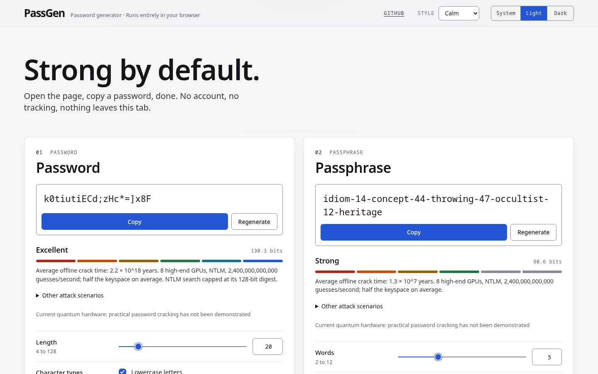
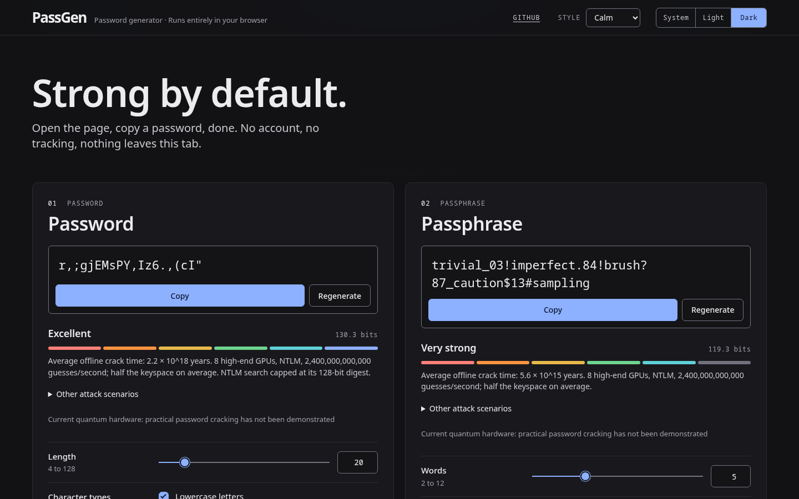
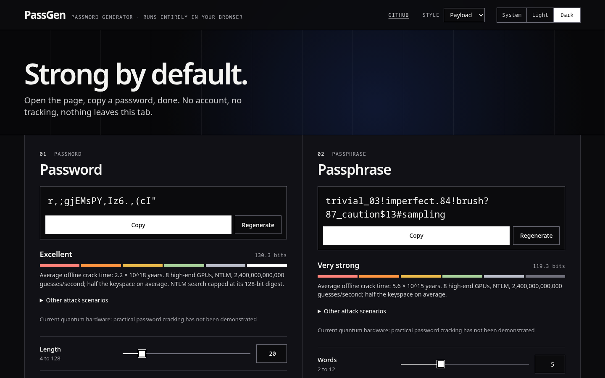
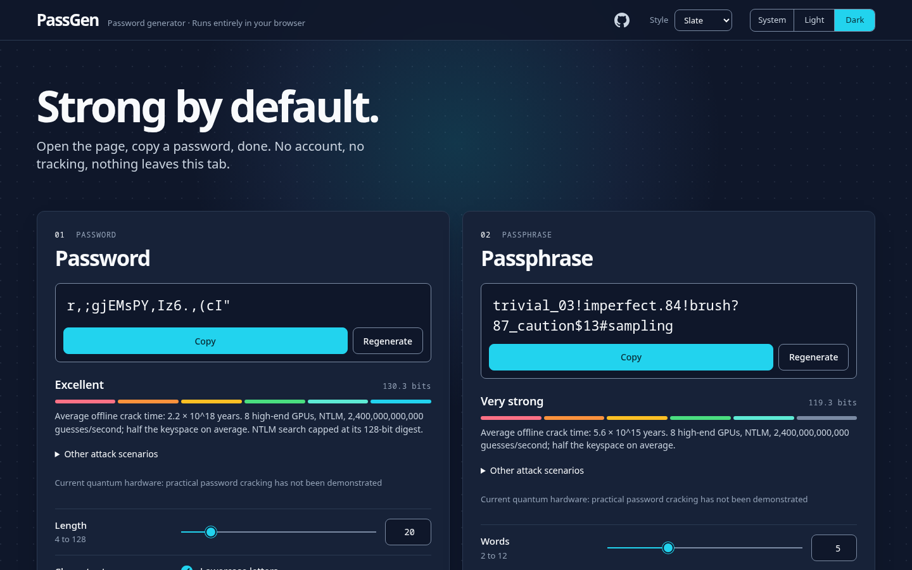
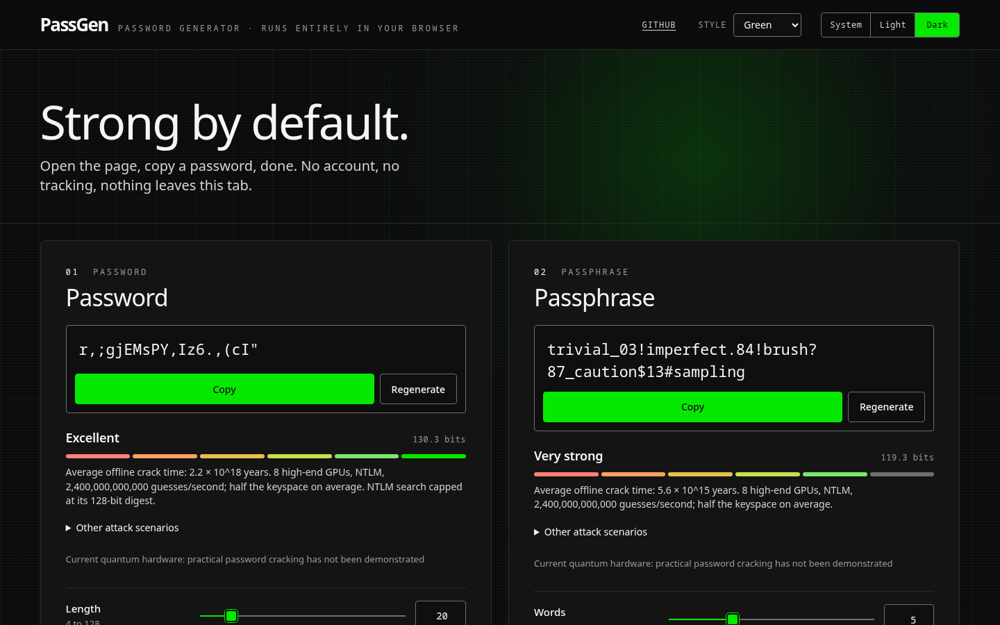
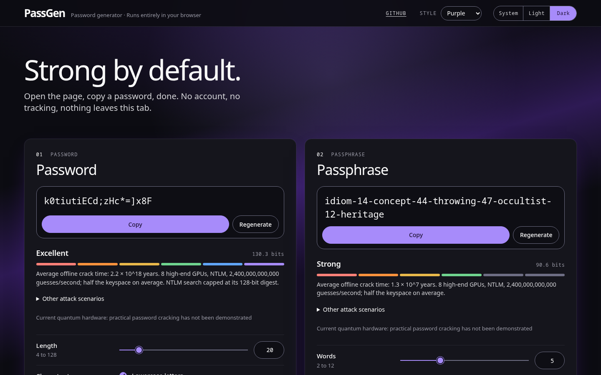
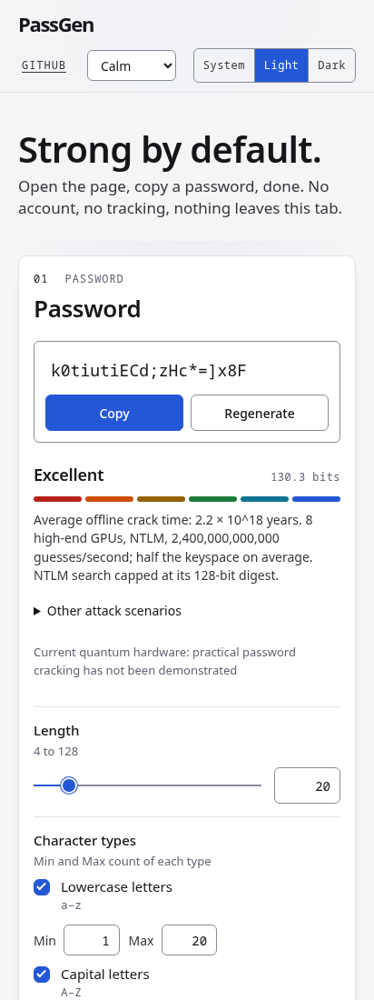

# PassGen

A no-nonsense password and passphrase generator. Open the page, a strong password
is already there, copy it, done. Everything happens in your browser: no accounts,
no tracking, no third-party code, and no network requests after the page loads.

PassGen is a folder of static files. It works on any ordinary static web server, at
any domain or subpath, with no hosting provider, CDN or domain required.

**Status:** v1 is released, with both generators, strength estimates, extra
results, saved settings, and five visual styles. See `CHANGELOG.md` for what
has changed since.

## Screenshots

Calm, the default style, in light and dark themes:

| Light | Dark |
|---|---|
|  |  |

The other four styles, shown in dark theme:

| Payload | Slate | Green | Purple |
|---|---|---|---|
|  |  |  |  |

[](docs/screenshots/calm-light-mobile.png)

These are fixed demonstration values; do not use them as passwords. Regenerate
with `pnpm screenshots` using the pinned toolchain and Playwright Chromium
(`pnpm exec playwright install chromium`). Images are reproducible on the same
OS, with reduced motion, a fixed clock, and no external requests.

## Deploy

PassGen is a folder of static files; any web server can host it.
Use its own hostname so other pages cannot read generated passwords.

### Install by hand

1. In a writable folder outside your web root, download the latest release and
   unzip it into a new site folder (`./passgen` here):

   ```sh
   curl --fail --location --output passgen.zip https://github.com/mcflycodes/passgen/releases/latest/download/passgen.zip &&
   unzip -DD passgen.zip -d ./passgen
   ```

2. Add the security headers: copy the ready-made site config and its header file
   for [Apache](deploy/examples/apache/passgen-site.conf) ([headers](deploy/examples/apache/passgen-headers.conf)),
   [nginx](deploy/examples/nginx/passgen-site.conf) ([headers](deploy/examples/nginx/passgen-headers.conf)) or
   [Caddy](deploy/examples/caddy/Caddyfile) ([headers](deploy/examples/caddy/passgen-headers.caddy)).
   Change the domain, absolute site folder, certificate and include paths, then
   validate and reload your server.
3. Open your HTTPS site.

### Update

Run from the same parent folder on Linux. This replaces the whole site, including
old hashed assets, and keeps the previous folder for rollback. Stop on errors;
move any existing `passgen-previous` backup elsewhere before the next update.
Allow a brief interruption while the folders switch; review release notes for
config/header changes.

```sh
curl --fail --location --output passgen.zip https://github.com/mcflycodes/passgen/releases/latest/download/passgen.zip &&
mkdir ./passgen-next &&
unzip -DD passgen.zip -d ./passgen-next &&
test ! -e ./passgen-previous && test ! -L ./passgen-previous &&
test -d ./passgen && test ! -L ./passgen &&
mv -T ./passgen ./passgen-previous &&
mv -T ./passgen-next ./passgen
```

### Install with an AI agent

> Fetch and follow the instructions at https://raw.githubusercontent.com/mcflycodes/passgen/main/agent-setup/prompt.md to set up PassGen for me.

Checksums, automatic backups and rollback, CDNs, SELinux and more: see the [self-hosting guide](docs/self-hosting.md).

## Requirements

- Node.js 22.23.2 (see `.nvmrc`)
- pnpm 11.15.1, pinned in `package.json` (`corepack enable` picks it up)
- Python 3 for release packaging and its unit tests

## Getting started

```sh
pnpm install --frozen-lockfile
pnpm exec playwright install   # browsers for the end-to-end tests
pnpm check                     # every local gate; see below
```

Other commands:

| Command | What it does |
|---|---|
| `pnpm dev` | Vite dev server (no meta CSP; the dev client needs inline script) |
| `pnpm build` | Production build into `dist/` |
| `pnpm screenshots` | Build and capture the README images in `docs/screenshots/` |
| `pnpm serve` | Serve `dist/` on `http://127.0.0.1:4173/` with the reference security headers (a local test server, not for deployment) |
| `pnpm headers:gen` | Regenerate `deploy/examples/` after changing `security/headers.ts` |
| `pnpm format` | Apply formatting and safe lint fixes |

## Gates

`pnpm check` runs these in order and stops at the first failure. PR and main CI
retain the static, build, supply-chain and attribution gates, with browser
coverage described below.

| Gate | Command |
|---|---|
| No runtime dependencies, exact pins, pnpm supply-chain settings | `pnpm deps:check` |
| No attribution to tools, models or vendors | `pnpm attribution:check` |
| No HTML sinks or executable/link attributes in shipped source | `pnpm html-sinks:check` |
| Authenticated wordlists and emitted modules match | `pnpm wordlist:check` |
| Typecheck (strict) | `pnpm typecheck` |
| Lint and format | `pnpm lint` |
| Unit tests | `pnpm test:unit` |
| Reference header snippets match the definition | `pnpm headers:check` |
| Style checks (R4b): tokens, contrast, CSS-only rules | `pnpm styles:check` |
| HTML-sink gate, configuration validation (C2) and style checks, then production build | `pnpm build` |
| No hostname beyond the configured links, no provider file, inline code or CSS resource in the build; CSP meta in place | `pnpm verify:dist` |
| SHA-256 manifest of the build | `pnpm manifest` |
| End-to-end, accessibility and header tests on the built files | `pnpm test:e2e` |
| Combined-gate regressions: injected fixtures through build, verify-dist and browser checks | `pnpm test:gate` |
| Dependency licenses | `pnpm licenses:check` |
| Dependency audit | `pnpm run audit` |

The end-to-end tests run on Chromium, Firefox and WebKit, plus mobile emulation.
On a machine that cannot launch every engine, narrow a local run explicitly, e.g.
`PASSGEN_E2E_PROJECTS=chromium,mobile-chrome pnpm check`. PR and main CI run
functional tests in the three desktop engines, the accessibility matrix in
Chromium and one matrix smoke case in each other engine. Known documentation-only
changes skip the browser and real-server jobs. The full five-project suite and
accessibility matrix run nightly and before releases on the tagged commit.
See [browser coverage](CONTRIBUTING.md#browser-coverage) for details.

## Configuration

`src/config/config.json` holds product defaults and limits, the offered styles
and the page text. Import it as JSON; there is no runtime dependency.
`src/config/validate.ts` checks the schema and security invariants before Vite
builds and in unit tests. Invalid configuration stops the build before any
files are emitted. The combined gates prove this with invalid configuration
fixtures.

The build fills `index.html` from the configuration (`scripts/lib/page-template.ts`):
the header tagline, the optional intro headline and paragraph, the control
defaults and bounds, the style options, the separator symbols and the two
outward links are inserted as escaped plain text and attribute values at build
time, with length caps checked by the validator and the result scanned by the
attribution and host-name checks. An empty tagline leaves the tagline out;
`text.intro.enabled: false` leaves the intro out; one offered style leaves the
Style control out. The footer also shows the version from `package.json`.

`links.repoUrl` is the repository link beside the Style control and
`links.licenseUrl` is the "Apache-2.0" link in the footer. Each is an `https`
URL, written in its normalised form with no credentials, or empty to leave
that link out. They render as plain anchors with `rel="noopener noreferrer"`,
cause no request. The footer also carries source and license URLs only for
the offered word lists, restricted to designated Credits anchors. The
host-name checks accept each one exactly as configured, as an anchor's `href`
and as the configuration string in the bundle, and nothing else.

Saved settings are explicit. "Save as my default" writes one snapshot of
every setting of both generators, the theme and the style to the browser's
local storage under one versioned key (`src/boot/storage.ts`); "Reset to
defaults" removes it and restores the configured defaults. A change made after
saving is not saved unless Save is pressed again, so a one-off tweak never
becomes the default. Each press is confirmed by a short status beside the
buttons, announced politely to screen readers, and a highlight on the button
that fades out (or simply ends under reduced motion). A stored record is
checked by `src/boot/stored-settings.ts` both before the first paint and when
the app starts, never includes a generated value, and is removed when it fails
the check. Nothing is written to storage until Save or Reset is pressed, not
even a probe; a browser whose storage cannot be read says so under the
buttons, and one that refuses the write says so when Save is pressed.

Unspecified slow-hash and online attack estimates are `null`: consumers must
show them as unavailable, rather than substituting an estimate. The optional
future quantum estimate is also unavailable. The wordlist build computes the
pool size for the configured default filter
and checks that the defaults reach the configured Strong threshold (at least
80 bits). No derived word count is stored in configuration.

## Passwords

`src/core/password.ts` exposes `generatePassword`, `generatePasswords`,
`planPassword`, `normalizeCounts`, `countPasswords` and `defaultOptions`. Each
selected character type (lowercase, uppercase, numbers, symbols; Simple and
Complex symbols count as one type) has a Min and a Max count, with Min 1 and
Max equal to the length by default. Every password of the chosen length that
meets every limit is exactly equally likely: the number of characters of each
type is drawn in proportion to how many valid passwords have those counts,
using exact integer arithmetic and the unbiased randomness core, the type
labels are shuffled with Fisher-Yates, and each position is filled with a
uniform pick from its type. `countPasswords` gives the exact number of valid
passwords for a request, which the strength meter will take the entropy from.
Invalid requests raise typed errors before any randomness is drawn, and no
error carries generated output.

## Wordlist and passphrases

PassGen offers exactly five unchanged, locally vendored word lists:

| List | Usable words | Real lengths | Default range | License |
|---|---:|---|---|---|
| Orchard Street Long (default) | 17,576 | 3–15 | 5–10 | CC BY-SA 4.0 |
| Orchard Street Medium | 8,192 | 3–10 | 5–10 | CC BY-SA 4.0 |
| EFF Large | 7,772 | 3–9 | 5–9 | CC BY 4.0 |
| EFF Short #1 | 1,295 | 3–5 | 3–5 | CC BY 4.0 |
| EFF Short #2 | 1,295 | 3–10 | 5–10 | CC BY 4.0 |

Orchard Street lists are by Sam Schlinkert, pinned at commit
`4fd015fe9a8e50d837d9f54cb39883bb801da1ed` in
[the primary repository](https://github.com/sts10/orchard-street-wordlists).
EFF lists are by Joseph Bonneau et al., from [EFF](https://www.eff.org/dice).
Full attribution, sources and licenses are in `NOTICE`. CC BY-SA covers the
Orchard list content and its bundled representation only; application code
remains Apache-2.0. The footer's native, collapsed Credits section lists only
the offered lists, with individual authors, license links, source links and
usable counts.

The build checks each raw SHA-256 against the verifier's pin and sidecar;
independent gate pins also lock the bytes. It validates entry counts, unique
lowercase a-z words and the complete length distribution. Dice codes are
removed from the EFF modules, and the existing filtering rule excludes four
hyphenated Large entries and `yo-yo` from each Short list.
`pnpm wordlist:gen` emits the local modules; `pnpm wordlist:check` and every
production build require them to match the authenticated inputs exactly.
No runtime fetch occurs. All five lists and every allowed length range are
tested for unique decoding without separators before counting entropy.

Deployment configuration uses `passphrase.wordLists.default` and
`passphrase.wordLists.offered`, an array of `{ id, defaultMin, defaultMax }`.
The ids are `orchard-long`, `orchard-medium`, `eff-large`, `eff-short1` and
`eff-short2`. Unknown ids, duplicates, an empty offered set, an unavailable
default, and ranges outside the corresponding real lengths fail validation.
Each list always exposes its real shortest and longest words. Switching lists
clamps the existing endpoints to those bounds and recalculates strength.
A deployment offering one list hides the dropdown. Saved defaults include
the selected list and range; Reset restores the deployment's defaults.

`src/core/passphrase.ts` exposes `generatePassphrase`, `filteredWordCount` and
`defaultPassphraseOptions`. Each word is picked independently with replacement;
each separator digit and each optional random capitalization bit use the unbiased
randomness core. Invalid options and empty pools raise typed errors without
returning output. Numbers have 1–3 digits (default 2), including leading zeros.
Symbols default to Random: each slot is an independent pick. Symbol position
can be Both sides (default), Before or After a number; without numbers each
separator has one symbol. Random (unique) never repeats within a separator
and uses every symbol once before starting another round. When slots exceed
the alphabet size, repeats are spread evenly and the panel shows a note.
Fixed symbols remain available. Capitalize offers Off (default), Random
(one independent case bit per word), and Every word (no added entropy).
The meter counts all valid sequences exactly. Saved settings use schema v5;
older settings are ignored and removed on Save or Reset.

The attribution gate blanks only the explicitly reviewed collision words in
`DICTIONARY_COLLISIONS`, within authenticated data lines and the verified
word-data literal. Bundles apply the same limited exception to verified string
or constant template literals. Every other dictionary word and all surrounding
content remain scanned. Browser checks retain rendered `innerText`, validate
marked output before replacing it with a placeholder in that rendered scan,
and separately scan every output with only the allowlisted words blanked.
Attributes, comments, CSS content and non-output text remain scanned.

## Interface

`src/main.ts` wires the page. `src/ui/password.ts` and `src/ui/passphrase.ts`
bind the controls to the generators and turn each core error into a message
with generation disabled; `src/ui/settings.ts` holds every user-changeable
setting in one serialisable object and binds the Save and Reset buttons;
`src/ui/theme.ts` applies the theme and style choices; `src/ui/pointer.ts` is the shared pointer effect for decorative
backgrounds; `src/ui/meter.ts` and `src/ui/results.ts` own the strength meter
and the extra-results markup.

The theme and style are applied before the first paint by a small classic
script, built from `src/boot/theme.ts` into `assets/boot-<hash>.js` and placed
in `<head>` before the stylesheet, so there is no inline script and the CSP is
unchanged. System follows `prefers-color-scheme` live through `color-scheme`
and `light-dark()` colours.

## Styles

A style is one stylesheet of design tokens under `src/styles/<id>/style.css`,
offered through `style.offered` in the configuration. The five shipped styles
are Calm (default), Payload, Slate, Green and Purple. `src/styles/README.md`
is the style guide: the token list, the rules every style must keep (tokens
only: custom properties in the style's own `:root[data-style]` rule, with no
ordinary property, other selector or at-rule; no external resource of any kind;
every required token for both themes, declared once along with everything a
colour token refers to; WCAG 2.2 AA contrast for the token pairs) and how to
test one. The checks judge the parsed, decoded CSS and its minified form; the
build runs them and fails on any problem, and `pnpm verify:dist` refuses any
resource in the emitted CSS.

## Security headers

`security/headers.ts` is the one definition of the page's security headers. From
it, the build puts the Content Security Policy in the page as a `<meta>` tag, so
the main protections hold even on a host that cannot set headers, and
`deploy/examples/` holds reference configs for Apache, nginx, Caddy, Cloudflare
Pages and Netlify. Those are examples only; none is required or preferred.

`pnpm serve` and the build checks are local tools. They refuse symbolic links
and anything outside the folder, but they assume nothing else on the machine
changes the folder while they run; that case is out of scope.

The build checks parse JavaScript with oxc and CSS with lightningcss (both part
of the Vite toolchain), check HTML against a byte-exact head structure, and
leave how the page actually parses to the browser tests. Host names are
recognised by their top-level domain, from a committed snapshot of IANA's list
in `scripts/lib/data/iana-tlds.txt`; refresh it from
`https://data.iana.org/TLD/tlds-alpha-by-domain.txt` when needed. The one
exceptions are the configured links (`links.repoUrl`, `links.licenseUrl`) and
the offered word lists’ source/license links in the Credits section, which
may appear exactly as configured as an anchor's `href` in the page and as a
whole string in the bundle; written any other way, or anywhere else, they are
reported like any other address.

Each build also writes `dist-manifest/SHA256SUMS`, so anyone can check that a
deployed copy matches a reviewed build: run `sha256sum -c SHA256SUMS` inside the
served folder.

See [self-hosting](docs/self-hosting.md) for server setup and CDN settings, and
[build and deployment verification](docs/verify.md) for the S7 manifest checks.

## License

Apache-2.0. See `LICENSE` and `NOTICE`.

## Contributing

See [CONTRIBUTING.md](CONTRIBUTING.md) for setup, checks and contribution guidelines.

## Security

See [SECURITY.md](SECURITY.md) for supported versions, private vulnerability
reporting and the security model.
